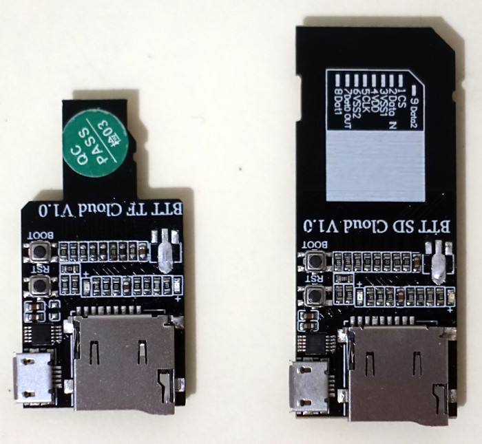

# Alternative BTT TF Cloud V1.0 Firmware (AFW)
This is a custom firmware for the BTT TF Cloud V1.0 (https://github.com/bigtreetech/BTT-SD-TF-Cloud-V1.0) devices.

**Changes from the original BTT TF Cloud V1.0 firmware**

* Hardcoded SSID and password (to make WiFi working also without accessible SD card)
* SD card is used only when a connection via WebDAV is established
* FTP server (works with FileZilla)

**Top**



**Bottom**


This repository is based on the work of ardyesp (https://github.com/ardyesp/ESPWebDAV). Thanks! 


# Building
PlatformIO (https://platformio.org/) is recommended but also the classic Arduino IDE should work. You need to install the [Arduino esp8266 libraries](https://github.com/esp8266/Arduino). PlatformIO should install it automatically.

## How to
1. Open PlatformIO

2. Open the folder with this repository

3. Adapt `WiFiSettings.h`to your WiFi settings

4. Build it

5. Connect your PC to the device  
**WARNING: Don't insert the BTT device the same time in a SD slot because of back feeding the voltage or remove the LM1117 voltage regulator (see below)!**

6. Upload it to the device
7. When PlatformIO (esptool) is trying to connect to the BTT device press and hold the BOOT switch and hit the RST switch a shot of time.

```
Uploading .pio/build/esp12e/firmware.bin
esptool.py v2.8
Serial port /dev/ttyUSB0
Connecting........_____..
```

8. Wait until the flash process is done

9. Reset the device again with the RST switch.

# Technical Stuff

## WebDAV Server 
This project is a WiFi WebDAV server using ESP8266 SoC. It maintains the filesystem on an SD card.

Supports the basic WebDav operations - *PROPFIND*, *GET*, *PUT*, *DELETE*, *MKCOL*, *MOVE* etc.

Once the WebDAV server is running on the ESP8266, a WebDAV client like Windows can access the filesystem on the SD card just like a cloud drive. The drive can also be mounted like a networked drive, and allows copying/pasting/deleting files on SD card remotely.

## FTP Server
The FTP server is tested with (FileZilla)[https://filezilla-project.org/]. If you would like to use another FTP client read the limiations, please.

**Limitations**
* The LIST command is not supported so the most FTP clients will not work
* Only supports passive FTP mode
* No encryption
* Accepts only 1 connection at the same time


## Pinout

BTT TF Cloud hardware uses the following SD card connections:

ESP Module|SD Card
---|---
GPIO13|MOSI   
GPIO12|MISO   
GPIO14|SCK    
GPIO4|CS   
GPIO5|CS Sense

## Schematic
The real BTT TF Cloud schematic is fully documented and may different from the following schematics. At the official GitHub repo (https://github.com/bigtreetech/BTT-SD-TF-Cloud-V1.0) only a few information can be found.

It looks like that the BTT TF Cloud is using a schematic like this one: https://3dtoday.ru/blogs/massaraksh7/sd-karta-s-wifi-na-esp8266-dlya-3d-printera-plug-and-play?fbclid=IwAR3Re1DvyVIkiezvatVK9iViC1FurmdtnGOtBKMQJc4QwWB763S28cFTv2s


Here is another sample schematic which is similar to the BTT TF Cloud devices. 


The card should be formatted for Fat16 or Fat32

To access the drive from Windows, type ```\\esp_hostname_or_ip\DavWWWRoot``` at the Run prompt, or use Map Network Drive menu in Windows Explorer.


## Development
### Remove of LM1117
To connect the ESP8266 to USB and let the device connected via SD it is necessary to remove the LM1117 voltage regulator.


### Ideas
* Integrate WiFiManager to get rid of the hard coded WiFi settings: https://github.com/tzapu/WiFiManager
