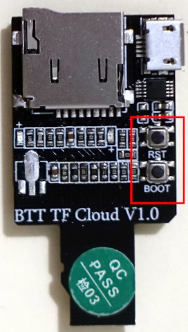
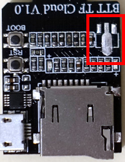

# Alternative BTT TF Cloud V1.0 Firmware (AFW)
This is a custom firmware for the BTT TF Cloud V1.0 devices.

More information about these devices can be found at the official repro https://github.com/bigtreetech/BTT-SD-TF-Cloud-V1.0.

*DISCLAIMER: This program is distributed in the hope that it will be useful, but WITHOUT ANY WARRANTY; without even the implied warranty of MERCHANTABILITY or FITNESS FOR A PARTICULAR PURPOSE. See the GNU General Public License for more details.*

## Features

* FTP server (tested with FileZilla)
* WebDAV server
* WiFi config mode via an access point
* SD card is in use only when a connection (WebDAV or FTP) is established
* Over-the-Air (OTA) firmware update via a web interface

## Download
The latest release can be found here: https://github.com/AlbrechtL/BTT_TF_Cloud_AFW/releases

## Installing
**`esptool.py`** is needed for the flashing AFW initially. Please visit https://github.com/espressif/esptool for details.

A backup of the original firmware is always recommended. Read the section "Backup of original firmware", please.

### Over-the-Air (OTA)
This options is only available if you already have an installed AFW.

* Download the latest release
* Open a web browser
* Browse to `http://<your IP>:8080/webota`
* Select the AFW firmware e.g. `BTT-SD-TF-Cloud_AFW_0.1.bin`
* Click update

### Windows
TBD

### Linux
* Download the latest release
* Disconnect the BTT TF Cloud device from the SD card slot. **WARNING: If you don't do this you can damage your device with the SD or miroSD slot.**
* Connect it via USB
* Discover which serial interface is used
* Start `esptool.py -p <your serial port> write_flash 0x0000 <your download firmware.bin>`
Example:

```
# esptool.py -p /dev/ttyUSB0 write_flash 0x0000 BTT-SD-TF-Cloud_AFW_0.1.bin 
```

* Wait until `esptool.py` reports `Connecting..`

```
esptool.py v3.0
Serial port /dev/ttyUSB0
Connecting........_____.....___
```

* First, press and hold the BOOT push button and second press the RST push button

* Release both buttons at the same time
* The flash process should run now

```
# esptool.py -p /dev/ttyUSB0 write_flash 0x0000 BTT-SD-TF-Cloud_AFW_0.1.bin 
esptool.py v3.0
Serial port /dev/ttyUSB0
Connecting........_
Detecting chip type... ESP8266
Chip is ESP8266EX
Features: WiFi
Crystal is 26MHz
MAC: XX:XX:XX:XX:XX:XX
Uploading stub...
Running stub...
Stub running...
Configuring flash size...
Compressed 387296 bytes to 276107...
Wrote 387296 bytes (276107 compressed) at 0x00000000 in 24.4 seconds (effective 126.8 kbit/s)...
Hash of data verified.

Leaving...
Hard resetting via RTS pin...
```

* Press the RST button to restart the device
* To verify the new firmware you can use a serial terminal e.g. minicom

```
# minicom -D /dev/ttyUSB0 -b 115200

��$s�`��'�

**********************************************
BTT TF Cloud AFW Version 0.1
**********************************************

--------------------------------
Connect to WiFi
--------------------------------
*WM: 
*WM: AutoConnect
*WM: Connecting as wifi client...
*WM: Status:
*WM: 6
*WM: Using last saved values, should be faster
*WM: Connection result: 
*WM: 3
*WM: IP Address:
*WM: 10.1.40.249
connected...yeey :)

--------------------------------
Start firmware update server
--------------------------------

Connected to 'XXXXXXXXX'

IP address   : 10.1.40.249
MAC address  : XX:XX:XX:XX:XX:XX 
mDNS started : BTT_TF_CLOUD_AFW.local
WebOTA url   : http://BTT_TF_CLOUD_AFW.local:8080/webota


--------------------------------
Start WebDAV server
--------------------------------
WebDAV server started

--------------------------------
Start FTP server
--------------------------------
FTP server started

Ftp server waiting for connection on port 21

```

* Now you can setup your WiFi, see section "WiFi Config"
* Put the BTT TF Cloud back into your SD or microSD card slot

## Tested BTT TF Cloud V1.0 Hardware
**Top**


**Bottom**


## Usage

### WiFi Config
If no WiFi settings are stored the device opens a new access point with the SSID `BTT_TF_CLOUD_AFW`. 

**How to set up**

* Connect via to the WiFi `BTT_TF_CLOUD_AFW`
* Browse to `http://192.168.4.1`
* Configure your requested WiFi
* Save

**How to reset your config**

* Power on the device
* Press the `BOOT` button up to 5 seconds until the LED is starting to blink
* Release the button
* When the LED is off the device reboots
* Proceed like above

### WebDAV Server 
This project is a WiFi WebDAV server using ESP8266 SoC. It maintains the filesystem on an SD card.

Supports the basic WebDav operations - *PROPFIND*, *GET*, *PUT*, *DELETE*, *MKCOL*, *MOVE* etc.

Once the WebDAV server is running on the ESP8266, a WebDAV client like Windows can access the filesystem on the SD card just like a cloud drive. The drive can also be mounted like a networked drive, and allows copying/pasting/deleting files on SD card remotely.

### FTP Server
The FTP server is tested with [FileZilla](https://filezilla-project.org/). If you would like to use another FTP client read the limiations, please.

**Limitations**

* The LIST command is not supported so the most FTP clients will not work
* Only supports passive FTP mode
* No encryption
* Accepts only 1 connection at the same time

## Building
PlatformIO (https://platformio.org/) is required and it should install the dependencies automatically.

### How to
1. Open PlatformIO

2. Open the folder with this repository

3. Build it

4. Connect your PC to the device  
**WARNING: Don't insert the BTT device the same time in a SD slot because of back feeding the voltage or remove the LM1117 voltage regulator (see below)!**

5. Upload it to the device
6. When PlatformIO (esptool) is trying to connect to the BTT device press and hold the BOOT switch and hit the RST switch a shot of time.

```
Uploading .pio/build/esp12e/firmware.bin
esptool.py v2.8
Serial port /dev/ttyUSB0
Connecting........_____..
```

8. Wait until the flash process is done

9. Reset the device again with the RST switch.

## Technical Stuff
### Backup of original firmware
* Backup the original firmware by using the command `esptool.py -p <your serial port> read_flash 0x0000 0x400000 BTT_Original_Firmware.bin`

```
# esptool.py -p /dev/ttyUSB0 read_flash 0x00000 0x400000 BTT_Original_Firmware.bin
```
* Wait until `esptool.py` reports `Connecting..`

```
esptool.py v3.0
Serial port /dev/ttyUSB0
Connecting........_____.....___
```

* First, press and hold the BOOT push button and second press the RST push button
* Release both buttons at the same time
* The reading process should run now

*HINT: Your can find the original firmware also inside the folder "original_firmware" in this repo.*

### Pinout

BTT TF Cloud hardware uses the following SD card connections:

ESP Module|SD Card
---|---
GPIO13|MOSI   
GPIO12|MISO   
GPIO14|SCK    
GPIO4|CS   
GPIO5|CS Sense

### Schematic
The real BTT TF Cloud schematic is fully documented and may different from the following schematics. At the official GitHub repo (https://github.com/bigtreetech/BTT-SD-TF-Cloud-V1.0) only a few information can be found.

It looks like that the BTT TF Cloud is using a schematic like this one: https://3dtoday.ru/blogs/massaraksh7/sd-karta-s-wifi-na-esp8266-dlya-3d-printera-plug-and-play?fbclid=IwAR3Re1DvyVIkiezvatVK9iViC1FurmdtnGOtBKMQJc4QwWB763S28cFTv2s


Here is another sample schematic which is similar to the BTT TF Cloud devices. 


The card should be formatted for Fat16 or Fat32

To access the drive from Windows, type ```\\esp_hostname_or_ip\DavWWWRoot``` at the Run prompt, or use Map Network Drive menu in Windows Explorer.


### Remove of LM1117 
To connect the ESP8266 to USB and let the device connected via SD it is necessary to remove the LM1117 voltage regulator.




## Thanks
* ardyesp for ESPWebDAV https://github.com/ardyesp/ESPWebDAV
* Jean-Michel Gallego, David Paiva and others for ESP8266FTPServer https://github.com/nailbuster/esp8266FTPServer 
* Scott Baker for ESP-WebOTA: https://github.com/scottchiefbaker/ESP-WebOTA
* tzapu for https://github.com/tzapu/WiFiManager
